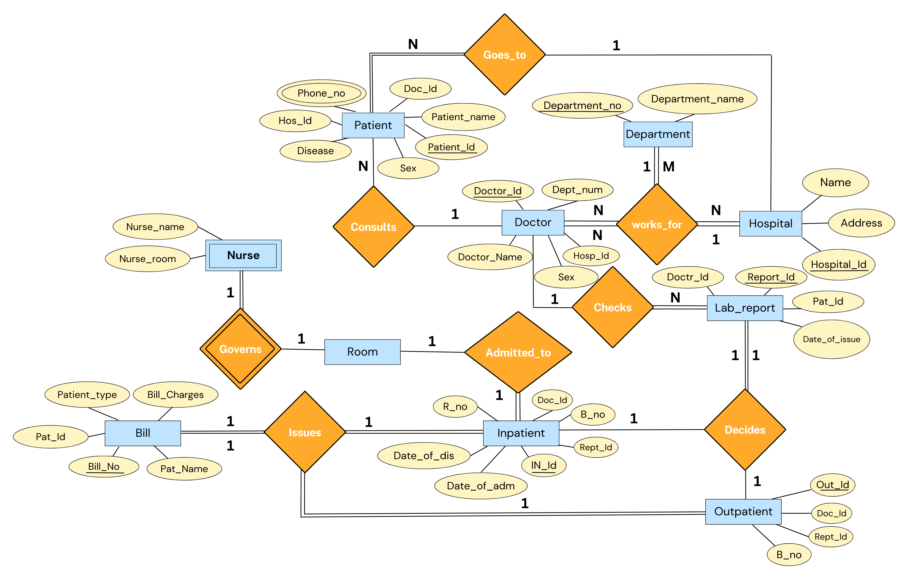

# 
Hospital Management System

## Introduction:

Hospital management involves overseeing and coordinating various aspects of healthcare facilities, including administrative tasks, financial management, resource allocation, staff supervision, and strategic planning. It aims to ensure efficient operations, quality patient care, effective communication, and optimal utilization of resources within a hospital or healthcare organization.

Ultimately, hospital management plays a vital role in achieving organizational goals, enhancing patient satisfaction, and improving overall healthcare outcomes.

## ER Model:

The structure of our database (in the form of an entity - relationship model) consists of:

- **10** entities
- **8** relationships.

**The entities (10):**

- **Hospital** - Each member of this entity class represents a Hospital name. Multiple Departments and Doctors 'work_for' a single Hospital.
- **Department** - Each member of this entity class refers to a specialized division or unit within the hospital that focuses on providing specific medical services, treatments, or care to patients. Multiple Doctors in our inventory 'works_for' the same Department and multiple Departments 'works_for' the same hospital.
- **Doctor** - Each member refers to a person who play a vital role in the healthcare system and are responsible for providing medical care to patients in various hospital settings. Multiple Doctors in our inventory 'works_for' same department under same hospital.
- **Patient** - Each member refers to an individual who is receiving medical care, treatment, or services within the hospital facility. Patients seek hospitalization for various reasons, including illness, injury, surgery, diagnostic procedures, or ongoing medical management.
- **Bill** - Represents the a detailed document or statement that outlines the charges and costs associated with the medical services, treatments, procedures, and other healthcare-related expenses provided to a patient. It serves as a financial record of the services rendered by the hospital and serves as a basis for billing the patient or their insurance provider.
- **Room** - Each member of this entity refers to a designated space within the hospital facility where patients (particularly Inpatients) are accommodated and receive care during their hospital stay.
- **Inpatient** - Each member corresponds to a category of hospital care where a patient is admitted to and stays within the hospital for a certain period of time to receive medical treatment, monitoring, or surgical procedures.
- **Outpatient** - Each member corresponds to a category of healthcare services provided to patients in a hospital setting where they do not require overnight admission. Patients who receive outpatient care visit the hospital or clinic for scheduled appointments, procedures, or tests and return home on the same day.
- **Lab_Report** - Each member of this entity play a crucial role in diagnosing medical conditions, monitoring treatment effectiveness, and providing valuable information for healthcare providers to make informed decisions about patient care.
- **Nurse** - Each member of this entity plays a vital role in providing direct patient care, promoting health, preventing illness, and assisting in the overall management of patient well-being within a hospital setting.

**The relationships (8):**

- **Consults** - Connects patient to doctor. We thought of including total participation from patients here because every patient will reach out to a doctor but it is not necessary that every doctor consult every patient hence partial participation from doctor. The relation is many-to-one, in the sense that multiple patients can consult to the same doctor.
- **Goes_to** - Connects patients to hospital. The relation is many-to-one, in the sense that multiple patients can admit into the same hospital. We thought of including total participation from patients here because every patient will admit into a hospital but it is not necessary that every hospital admits every patient hence partial participation from hospital.
- **Works_for** - This is a ternar relation that joins the department, hospital and doctor. It has total participation from all sides as every doctor will work for some or the other department or hospitl, similarly every department works for some or the other hospital. Doctor works for hospital and department is many to one as many doctor can work for same hospital and same departmen. Department works for hospital is also many to one because many department can be available in one hospital.
- **Checks** - This relation joins members of the doctor and lab report of patient. Here, doctor checks the lab report of the patient and every lab report will be checked by some or the other doctor so total participation from lab reports but every doctor will not check every lab report so partial participation from doctor side. many lab reports can be checked by same doctor, so many to one relationship is established.
- **Decides** -This relation joins lab report, inpatient and outpatient. It is a ternary relationship and decides whether the patient is an inpatient or an outpatient. All lab reports take part in this relation - so there’s total participation from lab report side. One lab report decides either one inpatient or one outaptient, so this is one to one relationship.
- **Admitted_to** - This relation joins members of the Inpatient to the room, and is used to represent the admission of an inpatient in the room of the hospital. One inpatient is allotted one room, so it is one to one relationship. All inpatient members partake in this relation - so there’s total participation but every room may not admit every inpatient - so this is partial participation.
- **Issues** - This relation joins members of the Inpatient, Outpatient and Bill, and is used to represent the overall expenses that are made by the inpatient and outpatients of inventory. It is a ternary relationship and each inpatient or outpatient issues a bill so, it is one to one relationship. All order members partake in this relation - so there’s total participation.
- **Governs** - This relation joins members of the Nurse and the room, and is used to determine the room that the nurse governs. A nurse can govern a single room, hence it is a one to one relationship. All nurse members partake in this relation as it is a weak entity - so there’s total participation. As nurse is a weak entity hence Governs is the identifying relationship.

**The ER Diagram:**

The resulting diagram:

## Relational Model:

A relational model is a way of conceptually representing and managing data in a database by putting it into tables.

Upon converting the previously mentioned Entity-Relationship diagram into a Relational Model, we obtain the following tables:

**Tables constructed from the entities (10):**

1. **Hospital**: (Hospital_Id, Name, Address)
2. **Department**: (Department_Id, Department_Name)
3. **Doctor**: (Doctor_Id, Doctor_Name, Sex, Department_Id, Hospital_Id)
4. **Patient**: (Patient_Id, Patient_Name, Disease, Sex, Doctor_Id, Hospital_Id)
    - **Phone_No**: (Patient_Id, Patient_Phone)
5. **Bill**: (Bill_no, Bill_Charges, Patient_Type, Patient_Id, Patient_Name)
6. **Room**: (Room_no, Room_Status)
7. **Inpatient**: (Inpatient_Id, Doctor_Id, Room_no, Report_Id, Date_of_Admission, Date_of_Discharge, Bill_no)
8. **Outpatient**: (Outpatient_Id, Doctor_Id, Report_Id, Bill_no)
9. **Lab_Report**: (Report_Id, Doctor_Id, Patient_Id, Date_of_Issue)
10. **Nurse**: (Nurse_Id, Nurse_Name, Room_no)

**Tables constructed from the M-N relationships (1):**

1. **Works_For**: (Hospital_Id, Department_Id)

## Result of mapping the HOSPITAL MANAGEMENT ER schema into a relational database schema:

## Table Constraints:

Constraints set restrictions on how much and what kind of data can be inserted, modified, and deleted from a table. Constraints are used to ensure data integrity during an update, removal, or insert operation on a table.

Below are the constraints that we impose on the constructed tables:

**Constraints on tables constructed from the entities (7):**

1. **Hospital**: 
   - Primary Key: Hospital_Id
   - Name and Address should not be NULL.

2. **Department**: 
   - Primary Key: Department_Id
   - Department_Name should not be NULL.

3. **Doctor**: 
   - Primary Key: Doctor_Id
   - Foreign Keys: Department_Id (references Department), Hospital_Id (references Hospital)
   - Doctor_Name and Sex should not be NULL.

4. **Patient**: 
   - Primary Key: Patient_Id
   - Foreign Keys: Doctor_Id (references Doctor), Hospital_Id (references Hospital)
   - Patient_Name and Sex should not be NULL.

5. **Bill**: 
   - Primary Key: Bill_no
   - Patient_Id is now an INT to match the Patient table.

6. **Room**: 
   - Primary Key: Room_no
   - Room_Status should not be NULL.

7. **Inpatient**: 
   - Primary Key: Inpatient_Id
   - Foreign Keys: Doctor_Id (references Doctor), Room_no (references Room), Report_Id (references Lab_Report), Bill_no (references Bill)

8. **Outpatient**: 
   - Primary Key: Outpatient_Id
   - Foreign Keys: Doctor_Id (references Doctor), Report_Id (references Lab_Report), Bill_no (references Bill)

9. **Lab_Report**: 
   - Primary Key: Report_Id
   - Foreign Keys: Doctor_Id (references Doctor), Patient_Id (references Patient)

10. **Nurse**: 
    - Primary Key: Nurse_Id
    - Foreign Key: Room_no (references Room)

**Constraints on tables constructed from the relationships (1):**

1. **Works_For**: 
   - Primary Key: (Hospital_Id, Department_Id)
   - Foreign Keys: 
     - Hospital_Id (references Hospital)
     - Department_Id (references Department)
   - This table establishes a many-to-many relationship between hospitals and departments, ensuring that each department can be associated with multiple hospitals and vice versa. The combination of Hospital_Id and Department_Id as a composite primary key ensures that each pair is unique, preventing duplicate entries for the same hospital-department relationship.
